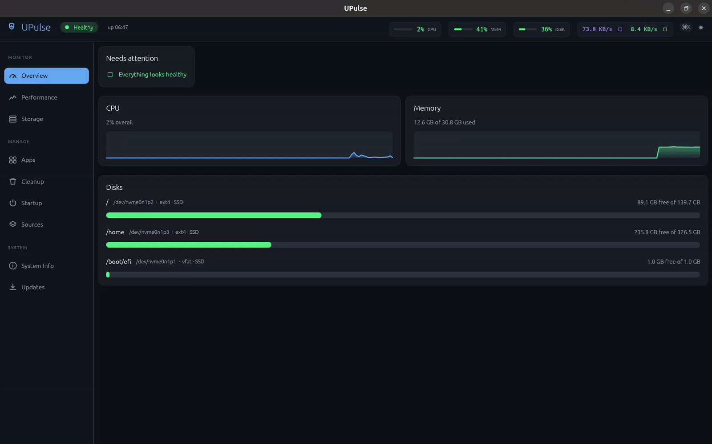

<p align="center">
  
</p>

<h1 align="center">UPulse</h1>


A fast, native control center for Ubuntu, written in Rust with
[egui](https://github.com/emilk/egui). One window to monitor, clean, and
maintain your system.

<p align="center"></p>

## What it does

- **Overview** — what needs attention right now (updates, reboot, low disk, high memory), each one a click away from its fix.
- **Performance** — live CPU, memory, network, and temperature graphs, plus a process table with sort, filter, and end-process.
- **Storage** — all mounted disks, a large-file scanner, and a build-artifact finder (`node_modules`, `__pycache__`, `.venv`, Cargo `target/`) with safe delete.
- **Apps** — installed packages sorted by size; uninstall (bulk too) or search and install new ones from APT.
- **Cleanup** — reclaim space: apt cache, unused packages, journald logs, crash reports, thumbnails, trash, old Snap revisions, unused Flatpak runtimes, and old kernels.
- **Startup** — toggle autostart apps and start/stop systemd services.
- **Sources** — list APT repositories, add PPAs, remove third-party ones.
- **System Info** — distro, kernel, CPU, memory, board/BIOS, GPU, sensors, battery.
- **Updates** — pending APT upgrades and Snap refreshes, applied in-app with a live log.

Safety is built in: never runs as root (per-action `pkexec` prompts), OS-critical
packages, services, repos, and kernels are read-only, and every destructive
action takes two clicks to fire.

## Install

Ubuntu 24.04 LTS or newer:

```bash
wget https://github.com/Rusty-Gopher/UPulse/releases/latest/download/upulse_1.1.0-1_amd64.deb
sudo apt install ./upulse_1.1.0-1_amd64.deb
```

Or build from source ([Rust](https://rustup.rs) + `sudo apt install build-essential pkg-config libgl1-mesa-dev libwayland-dev libxkbcommon-dev libx11-dev`):

```bash
git clone https://github.com/Rusty-Gopher/UPulse && cd UPulse && ./install.sh
```

## License

[MIT](LICENSE)
